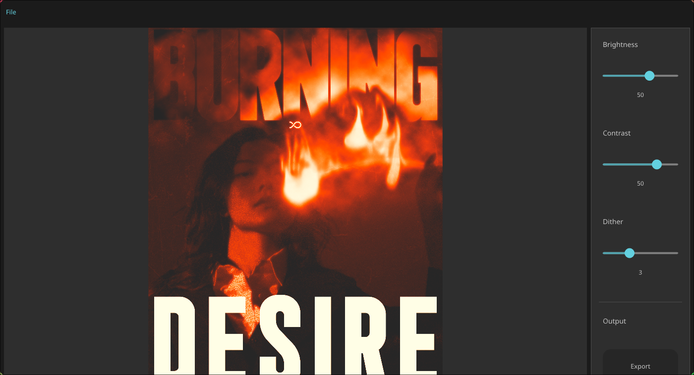

# OpenDither

A simple GUI tool built with [Slint](https://slint.dev/) and Rust to dither images.


## Getting Started

### Installation

**Recommended:** Download the latest pre-built binary for your operating system from the [GitHub Releases
](https://github.com/pezfisk/OxideManager/releases) page.

**Alternatively:** Build from source (see below).

## Building from Source

### Prerequisites

1. **Rust Toolchain:** Install Rust and Cargo from [rustup.rs](https://rustup.rs/).
2. **Git:** To clone the repository.

### Steps

1. **Clone the repository:**
   ```bash
   git clone https://github.com/pezfisk/OpenDither.git
   cd OpenDither
   ```

2. **Build (Native):**
    ```bash
    cargo build --release
    ```
   The executable will be in `target/release/`.

### Slint Backend and Style Configuration

You can configure the [Slint backend](https://docs.slint.dev/latest/docs/slint/reference/std-widgets/style/) (e.g.,
`winit`, `qt`, `gtk`) and style (`fluent`, `material`, `cupertino`, `cosmic`) at compile time:

#### **Slint backend**:

1. **Environment Variables (Temporary):**
   ```bash
   export SLINT_BACKEND=winit
   cargo build --release

   ```
2. **Cargo Configuration (Persistent):** Edit `.cargo/config.toml` in the project root:
   ```toml
   # .cargo/config.toml
   [env]
   SLINT_BACKEND = "winit"
   ```

#### **Style**:

1. Modify the `style` in `build.rs` for your platform:
      ```rust
      "linux" => {
          config = config.with_style("cosmic".into());
      }
      ```
2. Then run `cargo clean && cargo build --release`.

## Contributions are welcome!

